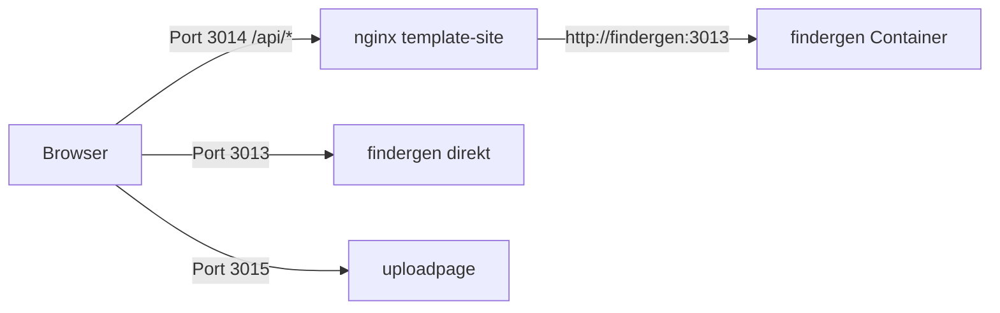

Fertig! Die SSG-Seite kann jetzt auf die findergen-API im anderen Container zugreifen.

## Was ich geändert habe

**`nginx.conf`** – Proxy für `/api/`-Anfragen:

- Alle Browser-Anfragen an `/api/...` gehen jetzt von nginx an `http://findergen:3013` weiter
- nginx setzt `Host`, `X-Real-IP`, `X-Forwarded-For` und `X-Forwarded-Proto` korrekt
- Die SSG-Seite ruft in Produktion bereits relative Pfade wie `/api/template/load/all` auf — diese landen jetzt beim findergen-Container im Docker-Netzwerk (Service-Name `findergen` wird von Docker DNS aufgelöst)

**`docker-compose.yml`** – `depends_on: findergen` bei `template-site` ergänzt, damit findergen (Port 3013 intern) vor der SSG-Seite startet.

## So funktioniert es



- **Template-Site (3014):** statische Dateien von nginx, `/api/*` wird an findergen im internen Docker-Netzwerk proxied → kein CORS-Problem, da die Requests vom gleichen Origin (`localhost:3014`) kommen
- **findergen (3013):** bleibt zusätzlich direkt erreichbar
- Die API-Endpunkte (`/api/template/load/all`, `/api/template/create`, `/api/mcapp/worlds`, `/api/system`, `/api/stop` usw.) funktionieren so über die Template-Site

## Ein Hinweis

`depends_on` wartet nur auf den Container-Start, nicht darauf, dass findergen wirklich bereit ist. Falls die API beim ersten Aufruf kurz nicht erreichbar ist, reicht ein Reload — oder ich ergänze einen Healthcheck (`/api/health` existiert ja) mit `condition: service_healthy`, wenn du das möchtest.

Made changes.

```sh
# start
docker compose up -d

# stop
docker compose down
```
